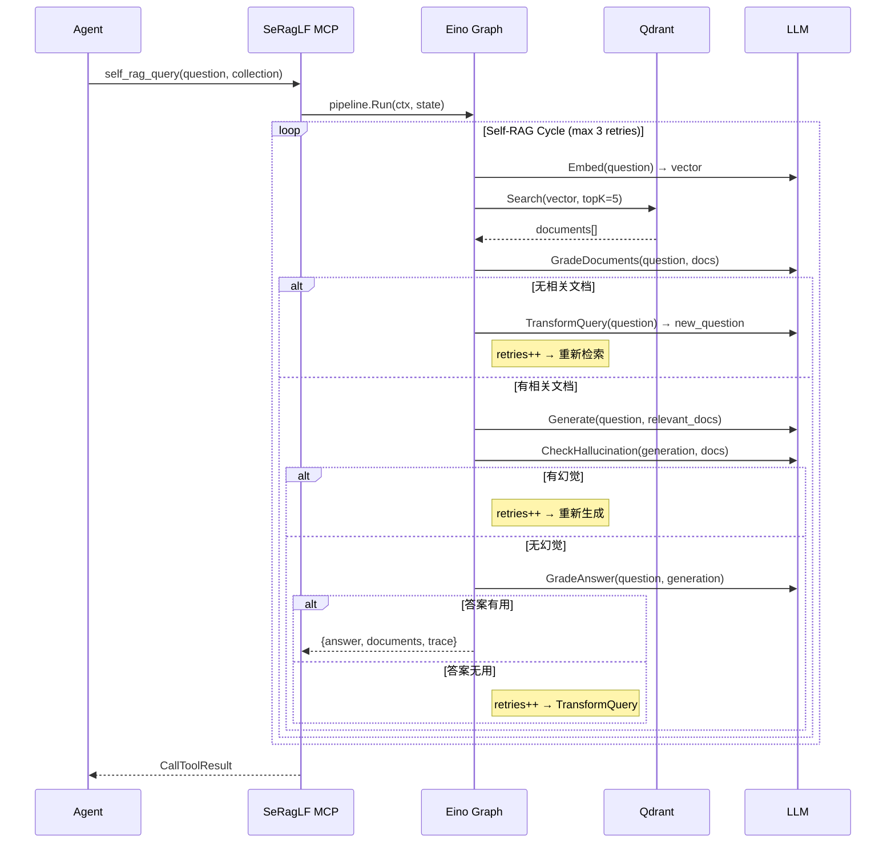
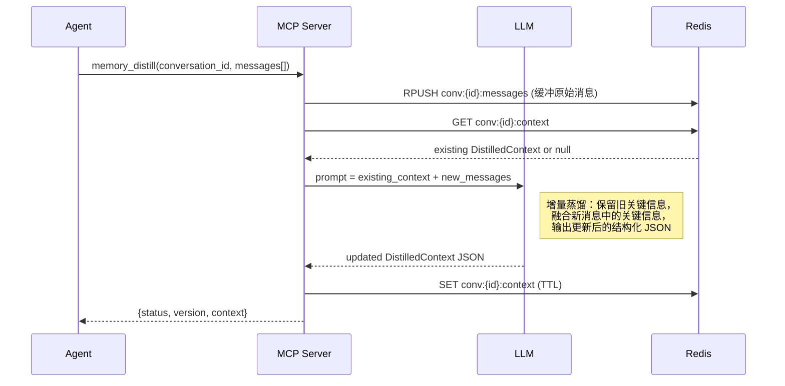

# SeRagLF API 设计文档

> MCP 工具定义、参数 Schema、返回值规范与调用示例

## 1. MCP 工具 (Tools)

### 1.1 self_rag_query

执行完整 Self-RAG 流程：检索 → 文档评估 → 生成 → 幻觉检测 → 答案质量评估。质量检查未通过时自动循环重试。

**参数结构体**：

```go
type SelfRAGQueryArgs struct {
    Question   string `json:"question"   jsonschema:"description=用户问题"`
    Collection string `json:"collection" jsonschema:"description=目标知识库集合"`
    MaxRetries int    `json:"max_retries,omitempty" jsonschema:"description=最大反思重试次数,default=3,minimum=1,maximum=10"`
    TopK       int    `json:"top_k,omitempty"       jsonschema:"description=每次检索文档数,default=5,minimum=1,maximum=20"`
}
```

**参数 Schema**：

```json
{
  "type": "object",
  "required": ["question", "collection"],
  "properties": {
    "question":    { "type": "string", "description": "用户问题" },
    "collection":  { "type": "string", "description": "目标知识库集合" },
    "max_retries": { "type": "integer", "default": 3, "minimum": 1, "maximum": 10 },
    "top_k":       { "type": "integer", "default": 5, "minimum": 1, "maximum": 20 }
  }
}
```

**返回结果**：

```json
{
  "content": [{
    "type": "text",
    "text": "{\"answer\":\"...\",\"documents\":[{\"content\":\"...\",\"source\":\"file.md\",\"score\":0.92}],\"trace_steps\":[{\"node\":\"retrieve\",\"status\":\"ok\",\"detail\":\"found 5 docs\"},{\"node\":\"grade_documents\",\"status\":\"ok\",\"detail\":\"3/5 relevant\"},{\"node\":\"generate\",\"status\":\"ok\"},{\"node\":\"check_hallucination\",\"status\":\"pass\"},{\"node\":\"grade_answer\",\"status\":\"pass\"}],\"retries\":0}"
  }]
}
```

**调用示例**：

```
Tool: self_rag_query
Arguments: {
  "question": "Kubernetes 中 Pod 的生命周期是怎样的？",
  "collection": "k8s-docs",
  "max_retries": 3
}
```

**内部执行路径**（Self-RAG 有向循环图）：



---

### 1.2 ingest_documents

将文档解析、分块、向量化后存入指定集合。

**参数结构体**：

```go
type IngestDocumentsArgs struct {
    SourcePath   string `json:"source_path"   jsonschema:"description=文档路径(文件或目录)"`
    Collection   string `json:"collection"    jsonschema:"description=目标集合(不存在则自动创建)"`
    ChunkSize    int    `json:"chunk_size,omitempty"    jsonschema:"description=分块大小(rune数),default=512,minimum=64,maximum=4096"`
    ChunkOverlap int    `json:"chunk_overlap,omitempty" jsonschema:"description=块间重叠(rune数),default=64,minimum=0,maximum=512"`
}
```

**返回结果**：

```json
{
  "status": "success",
  "documents_processed": 3,
  "chunks_created": 47,
  "vectors_stored": 47,
  "collection": "k8s-docs",
  "errors": []
}
```

**内部执行路径**：

```
source_path → ParseFile/ParseDirectory → raw text
    → ChunkText(chunk_size, overlap) → chunks[]
    → EmbedBatch(chunks[]) → vectors[]
    → Qdrant.Upsert(vectors, payloads) → ack
```

---

### 1.3 search_documents

纯语义搜索，不执行反思循环。适合快速检索或 Agent 自行判断相关性的场景。

**参数结构体**：

```go
type SearchDocumentsArgs struct {
    Query          string  `json:"query"      jsonschema:"description=搜索查询文本"`
    Collection     string  `json:"collection" jsonschema:"description=目标集合"`
    TopK           int     `json:"top_k,omitempty"           jsonschema:"description=返回结果数量,default=5,minimum=1,maximum=50"`
    ScoreThreshold float64 `json:"score_threshold,omitempty" jsonschema:"description=最低相似度阈值,default=0.0"`
}
```

**返回结果**：

```json
{
  "results": [
    {
      "content": "Pod 经历 Pending、Running、Succeeded/Failed 等阶段...",
      "score": 0.94,
      "metadata": { "source": "k8s-pod-lifecycle.md", "chunk_index": "3" }
    }
  ],
  "total": 5,
  "collection": "k8s-docs"
}
```

---

### 1.4 create_collection

创建新的知识库集合。

**参数结构体**：

```go
type CreateCollectionArgs struct {
    Name         string `json:"name"         jsonschema:"description=集合名称(唯一标识),required"`
    EmbeddingDim int    `json:"embedding_dim,omitempty" jsonschema:"description=向量维度,default=1536"`
    Distance     string `json:"distance,omitempty"      jsonschema:"description=距离度量: cosine/euclid/dot,default=cosine"`
}
```

---

### 1.5 list_collections

列出所有可用的知识库集合。**无参数**。

**返回结果**：

```json
{
  "collections": [
    { "name": "k8s-docs", "vectors_count": 1250 },
    { "name": "internal-wiki", "vectors_count": 5430 }
  ]
}
```

---

### 1.6 delete_collection

删除指定的知识库集合及其所有数据。

**参数结构体**：

```go
type DeleteCollectionArgs struct {
    Name    string `json:"name"    jsonschema:"description=要删除的集合名称,required"`
    Confirm bool   `json:"confirm" jsonschema:"description=确认删除(必须为true),required"`
}
```

---

---

## 2. Memory Tools

### 2.1 memory_distill

传入新消息，通过 LLM 增量蒸馏更新对话的上下文快照。同时将原始消息缓冲到内部 Redis List（供 `memory_save` 使用）。

**参数结构体**：

```go
type MemoryDistillArgs struct {
    ConversationID string           `json:"conversation_id" jsonschema:"description=对话唯一标识"`
    Messages       []memory.Message `json:"messages"        jsonschema:"description=新消息列表，用于蒸馏更新上下文"`
}

type Message struct {
    Role      string `json:"role"`       // "user" | "assistant" | "system"
    Content   string `json:"content"`
    Timestamp int64  `json:"timestamp"`  // Unix 秒，为 0 时自动填充当前时间
}
```

**执行流程**：



**蒸馏后的结构体**：

```go
type DistilledContext struct {
    ConversationID string   `json:"conversation_id"`
    Topics         []string `json:"topics"`        // 当前对话涉及的主题
    Decisions      []string `json:"decisions"`     // 已做出的关键决策
    Entities       []string `json:"entities"`      // 重要实体（人名、项目名、技术栈等）
    ActionItems    []string `json:"action_items"`  // 待办事项
    CurrentTask    string   `json:"current_task"`  // 当前正在处理的任务
    Narrative      string   `json:"narrative"`     // 自然语言概述
    UpdatedAt      int64    `json:"updated_at"`
    Version        int      `json:"version"`       // 蒸馏次数计数
}
```

**返回结果**：

```json
{
  "status": "success",
  "conversation_id": "conv-abc-123",
  "version": 3,
  "context": {
    "topics": ["Kubernetes Pod 生命周期", "CrashLoopBackOff 排查"],
    "decisions": ["使用 liveness probe 替代手动健康检查"],
    "entities": ["Kubernetes", "Pod", "CrashLoopBackOff"],
    "action_items": ["配置 readiness probe"],
    "current_task": "排查 Pod 频繁重启问题",
    "narrative": "用户正在排查 K8s Pod 频繁重启的问题，已确认是 liveness probe 配置不当导致。决定使用更合理的探针配置替代手动检查。",
    "updated_at": 1713000010,
    "version": 3
  }
}
```

---

### 2.2 memory_context

获取对话当前的蒸馏上下文快照。

**参数结构体**：

```go
type MemoryContextArgs struct {
    ConversationID string `json:"conversation_id" jsonschema:"description=对话唯一标识"`
}
```

**返回结果**：

```json
{
  "conversation_id": "conv-abc-123",
  "context": {
    "topics": ["Kubernetes Pod 生命周期"],
    "decisions": [],
    "entities": ["Kubernetes", "Pod"],
    "action_items": [],
    "current_task": "了解 Pod 生命周期",
    "narrative": "用户正在学习 Kubernetes 中 Pod 的生命周期阶段。",
    "updated_at": 1713000005,
    "version": 1
  }
}
```

若对话尚无蒸馏上下文，返回：

```json
{
  "conversation_id": "conv-abc-123",
  "context": null,
  "message": "no context distilled yet for this conversation"
}
```

---

### 2.3 memory_clear

清除对话的蒸馏上下文和内部消息缓冲。

**参数结构体**：

```go
type MemoryClearArgs struct {
    ConversationID string `json:"conversation_id" jsonschema:"description=对话唯一标识"`
}
```

---

### 2.4 memory_save

将对话持久化为长期记忆。从内部消息缓冲（`conv:{id}:messages`）读取原始对话内容，并行调用 LLM 完成两项任务：
1. **提取结构化事实** → 双写 MySQL `user_facts`（CRUD/去重）+ Qdrant `_user_facts`（语义索引，确定性 UUID v5 幂等覆写）
2. **生成对话摘要** → 向量化后写入 Qdrant `_memory` 集合

**参数结构体**：

```go
type MemorySaveArgs struct {
    UserID         string `json:"user_id"         jsonschema:"description=用户标识"`
    ConversationID string `json:"conversation_id" jsonschema:"description=要持久化的对话ID"`
}
```

**返回结果**：

```json
{
  "user_id": "user-001",
  "conversation_id": "conv-abc-123",
  "facts_extracted": 3,
  "facts_saved": 3,
  "summary_stored": true,
  "summary_preview": "用户讨论了 Kubernetes Pod 生命周期..."
}
```

**调用示例**：

```
Tool: memory_save
Arguments: {
  "user_id": "user-001",
  "conversation_id": "conv-abc-123"
}
```

---

### 2.5 memory_recall

召回用户的长期记忆。并行执行两路 Qdrant 语义搜索，均按 query 相关性排序：
1. Qdrant `_user_facts` — 召回与 query 相关的结构化事实
2. Qdrant `_memory` — 召回与 query 相关的历史对话摘要

**参数结构体**：

```go
type MemoryRecallArgs struct {
    UserID string `json:"user_id" jsonschema:"description=用户标识"`
    Query  string `json:"query"   jsonschema:"description=语义搜索查询"`
    TopK   int    `json:"top_k"   jsonschema:"description=召回历史对话数量,default=5"`
}
```

**返回结果**：

```json
{
  "user_id": "user-001",
  "relevant_facts": [
    {"category": "expertise", "fact_key": "primary_language", "fact_value": "Go", "score": 0.91},
    {"category": "preference", "fact_key": "framework", "fact_value": "偏好轻量级框架", "score": 0.85}
  ],
  "related_conversations": [
    {"summary": "讨论了 K8s Pod 生命周期和 CrashLoopBackOff 排查...", "score": 0.87},
    {"summary": "探讨了 Go 微服务的 gRPC 最佳实践...", "score": 0.82}
  ]
}
```

---

### 2.6 memory_user_profile

管理用户的结构化事实画像。支持 `list`（列出全部事实，走 MySQL 全量查询）和 `delete`（同步从 MySQL 和 Qdrant `_user_facts` 双删指定事实）两种操作。

**参数结构体**：

```go
type MemoryUserProfileArgs struct {
    UserID string `json:"user_id" jsonschema:"description=用户标识"`
    Action string `json:"action"  jsonschema:"description=操作: list 或 delete"`
    FactID int64  `json:"fact_id" jsonschema:"description=要删除的事实ID(action=delete时必填)"`
}
```

---

## 3. MCP Resources

### 2.1 seraglf://config

当前服务配置信息（脱敏后）。

```json
{
  "mcp_transport": "streamable_http",
  "mcp_port": 8080,
  "qdrant_host": "localhost:6334",
  "embedding_model": "text-embedding-3-small",
  "grader_model": "gpt-4o-mini",
  "generator_model": "gpt-4o",
  "default_max_retries": 3,
  "default_top_k": 5,
  "cache_enabled": true,
  "cache_ttl_hours": 24
}
```

### 2.2 seraglf://health

各组件健康状态。

```json
{
  "status": "ok"
}
```

---

## 4. 错误处理规范

### 3.1 MCP Tool 错误

MCP 工具通过 `CallToolResult.IsError = true` 标识错误：

```go
func errorResult(msg string) *mcp.CallToolResult {
    return &mcp.CallToolResult{
        Content: []mcp.Content{&mcp.TextContent{Text: msg}},
        IsError: true,
    }
}
```

### 3.2 错误分类

| 错误码 | 场景 | 处理方式 |
|--------|------|---------|
| `COLLECTION_NOT_FOUND` | 集合不存在 | 提示 Agent 先调用 `create_collection` |
| `QDRANT_UNAVAILABLE` | Qdrant 不可达 | 返回错误，建议检查基础设施 |
| `LLM_TIMEOUT` | LLM API 超时 | 返回当前最佳可用结果 |
| `LLM_ERROR` | LLM API 调用失败 | 重试 1 次后报错 |
| `EMBEDDING_FAILED` | 向量化失败 | 重试 1 次后报错 |
| `INVALID_PARAMS` | 参数校验失败 | 返回具体参数错误信息 |
| `INGEST_PARTIAL_FAILURE` | 部分文档解析失败 | 返回成功部分 + 失败列表 |
| `MAX_RETRIES_EXCEEDED` | Self-RAG 达到重试上限 | 返回当前最佳可用结果（非错误，降级返回） |

---

## 5. 配置文件示例

### 4.1 环境变量方式（推荐）

```bash
# MCP Server
SERAGLF_MCP_TRANSPORT=stdio              # stdio | http
SERAGLF_MCP_PORT=8080                     # http 模式端口

# LLM
SERAGLF_LLM_PROVIDER=openai
SERAGLF_LLM_API_KEY=sk-...
SERAGLF_LLM_GRADER_MODEL=gpt-4o-mini
SERAGLF_LLM_GENERATOR_MODEL=gpt-4o

# Embedding
SERAGLF_EMBEDDING_PROVIDER=openai
SERAGLF_EMBEDDING_API_KEY=sk-...
SERAGLF_EMBEDDING_MODEL=text-embedding-3-small

# Qdrant
SERAGLF_QDRANT_ADDR=localhost:6334

# Redis (纯缓存)
SERAGLF_REDIS_ADDR=localhost:6379

# MySQL
SERAGLF_MYSQL_DSN=root:localtest@tcp(localhost:3306)/seraglf?charset=utf8mb4&parseTime=True&loc=Local

# Memory
SERAGLF_MEMORY_SHORT_TERM_TTL_HOURS=24
SERAGLF_MEMORY_MAX_CONVERSATION_MESSAGES=200
SERAGLF_MEMORY_SUMMARY_COLLECTION=_memory
```

### 4.2 config.yaml 方式

```yaml
mcp:
  transport: stdio
  http_port: 8080

llm:
  provider: openai
  api_key: ${OPENAI_API_KEY}
  grader_model: gpt-4o-mini
  generator_model: gpt-4o

embedding:
  provider: openai
  api_key: ${OPENAI_API_KEY}
  model: text-embedding-3-small

qdrant:
  addr: localhost:6334

redis:
  addr: localhost:6379

mysql:
  dsn: root:localtest@tcp(localhost:3306)/seraglf?charset=utf8mb4&parseTime=True&loc=Local

memory:
  short_term_ttl_hours: 24
  max_conversation_messages: 200
  summary_collection: _memory

defaults:
  max_retries: 3
  top_k: 5
  chunk_size: 512
  chunk_overlap: 64
  embedding_dim: 1536
  distance: cosine
```

---

## 6. Makefile 目标

```makefile
.PHONY: build run test lint docker-up docker-down

build:                    # 编译 Go 二进制
	cd gateway && go build -o gateway ./cmd/gateway

run:                      # 本地 stdio 模式运行
	cd gateway && go run ./cmd/gateway -transport stdio

run-http:                 # 本地 HTTP 模式运行
	cd gateway && go run ./cmd/gateway -transport http

test:                     # 运行所有测试
	cd gateway && go test ./... -v -race

docker-up:                # 全栈启动
	docker compose up --build -d

docker-down:              # 全栈停止
	docker compose down
```
