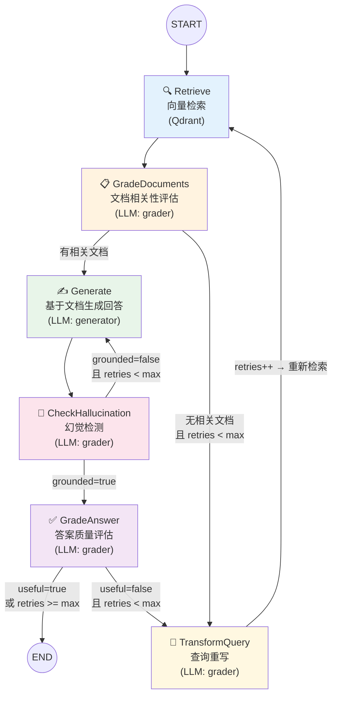

# SeRagLF 架构规划文档

> Self-RAG MCP Server — 纯 Go 单体架构（Eino + MCP Go SDK）

## 1. 项目概述

SeRagLF 是一个生产级 Self-RAG (Self-Reflective Retrieval-Augmented Generation) MCP Server。它将自反思检索增强生成能力封装为标准 MCP 服务，使任何兼容 MCP 协议的 Agent（Cursor、Claude Desktop 等）都能获得 "System 2" 级别的深度推理 RAG 能力。

### 1.1 Self-RAG 与传统 RAG 的区别

传统 RAG 是单向管线：检索 → 生成，不对中间结果做质量判断。Self-RAG 引入四类反思 Token（源自 Akari Asai 等人的论文 *Self-RAG: Learning to Retrieve, Generate and Critique through Self-Reflection*），在推理过程中自适应地评估：

| 反思 Token | 节点名称 | 评估内容 |
|------------|---------|---------|
| `[Retrieve]` | retrieve | 是否需要检索 / 何时检索 |
| `[IsRel]` | grade_documents | 检索到的文档是否与问题相关 |
| `[IsSup]` | check_hallucination | 生成的回答是否被文档证据支撑 |
| `[IsUse]` | grade_answer | 最终回答对用户是否有实际效用 |

当某一步评估未通过时，管线会**循环回退**——重新生成或重写查询后重新检索，直到产出高质量回答或达到重试上限。

### 1.2 架构决策

采用**纯 Go 单体架构**：

- **MCP 协议层**：MCP Go SDK v1.5.0，支持 stdio / Streamable HTTP
- **Self-RAG 编排**：Eino `compose.Graph`（字节跳动 CloudWeGo 生态），有向循环图原生支持
- **LLM / Embedding**：通过 Eino ChatModel / Embedder 组件调用 OpenAI 等 API
- **向量检索**：Qdrant 官方 Go gRPC 客户端
- **持久化**：MySQL 8.4（元数据/审计）
- **缓存**：Redis 7（纯缓存，embedding 向量缓存）

**不再需要 Python 微服务和 gRPC 双跳通信。** 整个服务编译为单一 Go 二进制。

---

## 2. 系统架构

### 2.1 整体拓扑

```
┌──────────────────────────────────────────────────────────────────┐
│                         MCP Clients                              │
│   ┌──────────┐   ┌───────────────┐   ┌──────────────┐           │
│   │ Cursor   │   │ Claude Desktop│   │ Custom Agent │           │
│   └────┬─────┘   └───────┬───────┘   └──────┬───────┘           │
│        └──────────────────┼──────────────────┘                   │
│                           │ MCP Protocol                         │
│                           │ (stdio / Streamable HTTP)            │
└───────────────────────────┼──────────────────────────────────────┘
                            │
┌───────────────────────────▼──────────────────────────────────────┐
│                   SeRagLF Gateway (单一 Go 二进制)                │
│                                                                  │
│  ┌─────────────────┐  ┌──────────────────┐  ┌────────────────┐  │
│  │  MCP Server     │  │  Self-RAG Engine  │  │  Ingest Engine │  │
│  │  (go-sdk)       │  │  (Eino Graph)     │  │  (Parser+Chunk)│  │
│  │                 │  │                   │  │                │  │
│  │  6 Tools        │  │  6 Nodes          │  │  ParseFile     │  │
│  │  2 Resources    │  │  3 Conditional    │  │  ChunkText     │  │
│  │                 │  │    Edges          │  │                │  │
│  └────────┬────────┘  └────────┬──────────┘  └───────┬────────┘  │
│           │                    │                      │          │
│  ┌────────▼────────────────────▼──────────────────────▼────────┐ │
│  │                  Internal Modules                           │ │
│  │                                                             │ │
│  │  ┌─────────┐  ┌──────────┐  ┌───────┐  ┌──────────────┐   │ │
│  │  │ LLM     │  │ Embedding│  │Qdrant │  │ Config       │   │ │
│  │  │(Eino    │  │(Eino     │  │Client │  │ (Viper)      │   │ │
│  │  │ChatModel│  │Embedder) │  │(gRPC) │  │              │   │ │
│  │  └────┬────┘  └────┬─────┘  └───┬───┘  └──────────────┘   │ │
│  │       │            │            │                           │ │
│  └───────┼────────────┼────────────┼───────────────────────────┘ │
└──────────┼────────────┼────────────┼────────────────────────────┘
           │            │            │
    ┌──────▼──────┐     │     ┌──────▼──────────────┐
    │  LLM API    │     │     │   Qdrant            │
    │  (OpenAI/   │     │     │   :6333 REST         │
    │   Claude/   │     │     │   :6334 gRPC         │
    │   Ark)      │     │     └─────────────────────┘
    └─────────────┘     │
                        │     ┌─────────────────────┐
                        │     │   Redis              │
                        └─────│   :6379 (纯缓存)     │
                              └─────────────────────┘

                              ┌─────────────────────┐
                              │   MySQL 8.4          │
                              │   :3306 (持久化)      │
                              └─────────────────────┘
```

### 2.2 模块职责

| 模块 | 路径 | 职责 |
|------|------|------|
| MCP Server | `internal/mcpserver/` | MCP 协议处理、Tool/Resource 注册与分发（12 Tools + 2 Resources）；短期记忆工具从 memory_append/memory_list 重构为 memory_distill/memory_context |
| Self-RAG Engine | `internal/selfrag/` | Eino Graph 有向循环图编排，6 节点 + 3 条件边 |
| Memory | `internal/memory/` | 双层记忆系统：短期 LLM 上下文蒸馏（Redis String）+ 内部消息缓冲（Redis List）+ 长期用户画像（MySQL 事实 + Qdrant 摘要向量） |
| Store | `internal/store/` | MySQL 连接池管理 + DDL 自动迁移 |
| LLM | `internal/llm/` | Eino ChatModel 封装，双模型（grader + generator） |
| Embedding | `internal/embedding/` | Eino Embedder 封装，向量化服务 |
| Qdrant Client | `internal/qdrant/` | 向量数据库 CRUD（Search/Upsert/Collection 管理，含 payload filter 搜索） |
| Ingest | `internal/ingest/` | 文档解析（txt/md/html）+ 文本分块 |
| Config | `internal/config/` | Viper 配置管理，YAML + 环境变量（含 Memory 配置段） |

---

## 3. Self-RAG 有向循环图

### 3.1 Eino Graph 状态图（Mermaid）



### 3.2 State 定义

```go
type State struct {
    Question      string         // 当前查询（可能被 TransformQuery 重写）
    Collection    string         // 目标向量集合
    Generation    string         // 当前生成的回答
    Documents     []RetrievedDoc // 检索到的文档
    Retries       int            // 当前重试次数
    MaxRetries    int            // 最大重试次数
    TopK          int            // 每次检索文档数
    Grounded      bool           // 幻觉检测结果
    AnswerUseful  bool           // 答案质量结果
    TraceSteps    []TraceStep    // 反思过程追踪
}
```

### 3.3 条件边逻辑

| 源节点 | 条件 | 目标节点 |
|--------|------|---------|
| grade_documents | `len(documents) > 0` | generate |
| grade_documents | `len(documents) == 0 && retries < max` | transform_query |
| grade_documents | `len(documents) == 0 && retries >= max` | generate（强制） |
| check_hallucination | `grounded == true` | grade_answer |
| check_hallucination | `grounded == false && retries < max` | generate（重试） |
| check_hallucination | `grounded == false && retries >= max` | grade_answer（接受） |
| grade_answer | `useful == true ∥ retries >= max` | END |
| grade_answer | `useful == false && retries < max` | transform_query |

### 3.4 Eino Graph 构建代码

```go
graph := compose.NewGraph[*State, *State]()

// 添加 6 个节点
graph.AddLambdaNode("retrieve",           compose.InvokableLambda(nodes.Retrieve))
graph.AddLambdaNode("grade_documents",    compose.InvokableLambda(nodes.GradeDocuments))
graph.AddLambdaNode("generate",           compose.InvokableLambda(nodes.Generate))
graph.AddLambdaNode("check_hallucination",compose.InvokableLambda(nodes.CheckHallucination))
graph.AddLambdaNode("grade_answer",       compose.InvokableLambda(nodes.GradeAnswer))
graph.AddLambdaNode("transform_query",    compose.InvokableLambda(nodes.TransformQuery))

// 固定边
graph.AddEdge(compose.START, "retrieve")
graph.AddEdge("retrieve", "grade_documents")
graph.AddEdge("generate", "check_hallucination")
graph.AddEdge("transform_query", "retrieve")  // 循环边

// 条件边 (3 个 branch)
graph.AddBranch("grade_documents", compose.NewGraphBranch(decideToGenerate, ...))
graph.AddBranch("check_hallucination", compose.NewGraphBranch(gradeGeneration, ...))
graph.AddBranch("grade_answer", compose.NewGraphBranch(gradeAnswerQuality, ...))

runnable, _ := graph.Compile(ctx)
```

### 3.5 优雅降级策略

1. **最大重试次数**：默认 `max_retries=3`，每次 transform_query 计数 +1
2. **全局超时**：context deadline 30s，超时后返回当前最佳结果
3. **Grader 使用轻量模型**：评估节点用 gpt-4o-mini，生成节点用 gpt-4o，延迟和成本最优
4. **Qdrant 不可达**：Self-RAG 退化为纯 LLM 生成（无检索上下文）

---

## 4. 核心数据流

### 4.1 Self-RAG 查询流程

```
Agent                        SeRagLF Gateway                    Qdrant       LLM API
  │                               │                               │            │
  │ ── self_rag_query ──────────► │                               │            │
  │    {question, collection}     │                               │            │
  │                               │                               │            │
  │                     ┌─────────┤ Eino Graph 循环开始            │            │
  │                     │         │                               │            │
  │                     │ [retrieve]                              │            │
  │                     │         │── EmbedQuery ─────────────────┼──────────► │
  │                     │         │◄─ vector ─────────────────────┼──────────┤ │
  │                     │         │── Search(vector, topK) ─────► │            │
  │                     │         │◄─ documents[] ───────────────┤ │           │
  │                     │         │                               │            │
  │                     │ [grade_documents]                       │            │
  │                     │         │── LLM(grader): 逐个评估 ─────┼──────────► │
  │                     │         │◄─ relevant/not_relevant ─────┼──────────┤ │
  │                     │         │                               │            │
  │                     │ [generate]                              │            │
  │                     │         │── LLM(generator): 生成回答 ──┼──────────► │
  │                     │         │◄─ generation ────────────────┼──────────┤ │
  │                     │         │                               │            │
  │                     │ [check_hallucination]                   │            │
  │                     │         │── LLM(grader): 幻觉检测 ─────┼──────────► │
  │                     │         │                               │            │
  │                     │ [grade_answer]                          │            │
  │                     │         │── LLM(grader): 质量评估 ─────┼──────────► │
  │                     │         │                               │            │
  │                     │ 若未通过 → transform_query → retrieve（循环）       │
  │                     │ 若通过   → 退出循环                     │            │
  │                     └─────────┤                               │            │
  │                               │                               │            │
  │ ◄── MCP tool result ─────────┤                               │            │
  │    {answer, documents,        │                               │            │
  │     trace_steps}              │                               │            │
```

### 4.2 文档摄入流程

```
Agent                        SeRagLF Gateway                    Qdrant       LLM API
  │                               │                               │            │
  │ ── ingest_documents ────────► │                               │            │
  │    {source_path, collection}  │                               │            │
  │                               │                               │            │
  │                               │ ParseFile / ParseDirectory    │            │
  │                               │ ChunkText (chunk_size, overlap)            │
  │                               │                               │            │
  │                               │── EmbedBatch(chunks[]) ──────┼──────────► │
  │                               │◄─ vectors[] ────────────────┼──────────┤ │
  │                               │                               │            │
  │                               │── Upsert(vectors, payloads) ─►│            │
  │                               │◄─ ack ──────────────────────┤ │           │
  │                               │                               │            │
  │ ◄── result ──────────────────┤                               │            │
  │    {documents_parsed,         │                               │            │
  │     chunks_created}           │                               │            │
```

---

## 5. 项目目录结构

```
SeRagLF/
├── Makefile                          # 构建、运行、Docker
├── docker-compose.yml                # 全栈编排
├── .gitignore
│
├── doc/
│   ├── design/
│   │   ├── architecture.md           # 本文档
│   │   └── api-design.md             # API 设计文档
│   ├── decision/
│   │   └── tech-selection.md         # 技术选型文档
│   └── log/
│       ├── progress-v0.1.0.md        # 规划阶段
│       ├── progress-v0.2.0.md        # 脚手架阶段
│       ├── progress-v0.3.0.md        # Docker 阶段
│       └── progress-v0.4.0.md        # 纯 Go 迁移阶段
│
└── gateway/                          # Go 主服务
    ├── Dockerfile                    # 多阶段构建 (alpine)
    ├── go.mod / go.sum
    ├── cmd/
    │   └── gateway/
    │       └── main.go               # 入口：初始化组件 → 启动 MCP Server
    └── internal/
        ├── config/
        │   └── config.go             # Viper 配置（LLM/Embedding/Qdrant/MySQL/Redis/Memory）
        ├── llm/
        │   └── llm.go                # Eino ChatModel（grader + generator）
        ├── embedding/
        │   └── embedding.go          # Eino Embedder
        ├── qdrant/
        │   └── client.go             # Qdrant gRPC 客户端（含 filter 搜索）
        ├── store/
        │   └── mysql.go              # MySQL 连接池 + user_facts 自动建表
        ├── memory/
        │   ├── types.go              # Message, Fact, DistilledContext, ConversationSummary 类型
        │   ├── short_term.go         # 短期记忆：蒸馏上下文（Redis String）+ 内部消息缓冲（Redis List）
        │   ├── long_term.go          # 长期记忆：MySQL 事实 + Qdrant 摘要向量（用户维度）
        │   └── extractor.go          # LLM 事实提取 + 对话摘要生成 + 上下文蒸馏
        ├── selfrag/
        │   ├── state.go              # State 定义 + TraceStep
        │   ├── nodes.go              # 6 个节点实现（Retrieve/Grade/Generate/...）
        │   └── graph.go              # Eino Graph 构建 + Pipeline.Run()
        ├── ingest/
        │   ├── parser.go             # 文档解析（txt/md/html）
        │   └── chunker.go            # 文本分块（rune 级，支持 Unicode）
        └── mcpserver/
            ├── server.go             # MCP Server 初始化（v0.5.0）
            ├── tools.go              # 6 个 RAG MCP Tool handler
            ├── tools_memory.go       # 6 个 Memory MCP Tool handler
            └── resources.go          # 2 个 MCP Resource handler
```

---

## 6. 部署架构

### 6.1 本地开发

```bash
docker compose up mysql qdrant redis -d    # 启动基础设施
make run                                    # 启动 MCP Server (stdio 模式，供 Cursor 直连)
```

### 6.2 Docker Compose 全栈

```bash
export OPENAI_API_KEY=sk-...
docker compose up --build -d               # gateway + mysql + qdrant + redis
```

4 个服务：gateway (Go) + mysql + qdrant + redis。

### 6.3 扩展策略

| 组件 | 扩展方式 | 瓶颈 |
|------|---------|------|
| Gateway | 无状态，水平扩展，前置 LB | LLM API 调用延迟（非 CPU） |
| Qdrant | 单节点百万级；分布式十亿级 | 内存（HNSW 索引驻内存） |
| MySQL | 主从复制 | 通常不是瓶颈 |
| Redis | 单节点即可 | 通常不是瓶颈 |
| LLM API | 并发调用数受 API Rate Limit 约束 | 主要瓶颈 |

---

## 7. 记忆系统

### 7.1 双层记忆模型

| 层级 | 维度 | 存储 | 生命周期 | 用途 |
|------|------|------|---------|------|
| 短期记忆 — 蒸馏上下文 | 对话 (`conversation_id`) | Redis String (`conv:{id}:context`) + TTL | 24h 自动过期 | LLM 增量蒸馏的上下文快照：主题/决策/实体/待办/当前任务/叙事摘要 |
| 短期记忆 — 消息缓冲 | 对话 (`conversation_id`) | Redis List (`conv:{id}:messages`) + TTL | 24h 自动过期 | 内部原始消息缓冲，供 `memory_save` 提取事实和生成摘要（不对外暴露） |
| 长期记忆 — 事实 | 用户 (`user_id`) | MySQL `user_facts`（CRUD） + Qdrant `_user_facts`（语义检索） | 永久 | 用户偏好、背景、技能等结构化画像，双写保证精确管理与语义召回兼得 |
| 长期记忆 — 摘要 | 用户 (`user_id`) | Qdrant `_memory` 集合 | 永久 | 历史对话摘要，语义检索 |

### 7.2 Memory MCP Tools

| Tool | 参数 | 功能 |
|------|------|------|
| `memory_distill` | `conversation_id`, `messages[]` | 传入新消息 → LLM 增量蒸馏 → 更新上下文快照；同时缓冲原始消息供 `memory_save` 使用 |
| `memory_context` | `conversation_id` | 获取当前蒸馏后的上下文快照（结构化 JSON） |
| `memory_clear` | `conversation_id` | 清除对话的蒸馏上下文和消息缓冲 |
| `memory_save` | `user_id`, `conversation_id` | 从内部消息缓冲读取原始对话 → LLM 提取事实 + 生成摘要，持久化到 MySQL + Qdrant |
| `memory_recall` | `user_id`, `query`, `top_k` | 两路并行语义搜索：相关事实（Qdrant `_user_facts`）+ 相关历史摘要（Qdrant `_memory`） |
| `memory_user_profile` | `user_id`, `action`, `fact_id` | 查看/删除用户结构化事实 |

### 7.3 数据流

```
对话进行中:
  Agent → memory_distill(conv_id, messages)
       ├→ Redis List 缓冲原始消息（内部使用）
       ├→ Redis GET 已有蒸馏上下文
       ├→ LLM 增量蒸馏（旧上下文 + 新消息 → 更新后的结构化 JSON）
       └→ Redis SET 蒸馏上下文

  Agent → memory_context(conv_id)
       └→ Redis GET → 返回 DistilledContext（topics/decisions/entities/action_items/current_task/narrative）

对话结束时:
  Agent → memory_save(user_id, conv_id)
       ├→ Redis List 读取内部消息缓冲 → LLM 提取事实 → MySQL UPSERT + Qdrant(_user_facts) 双写
       └→ Redis List 读取内部消息缓冲 → LLM 生成摘要 → Embedding → Qdrant(_memory)

新对话开始时:
  Agent → memory_recall(user_id, query)
       ├→ Qdrant 语义搜索 _user_facts → 相关事实（按 query 相关性排序）
       └→ Qdrant 语义搜索 _memory → 相关历史摘要
```
