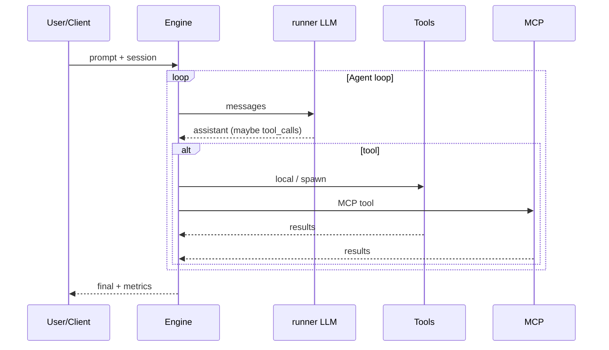

# loopForge 架构规划文档

> **Multi-Agent Engine** — 纯 Go、**原生 Agent loop**（`agent-sdk-go`），领域能力经 **MCP** 外接（典型：**SeRagLF**）。本文描述**系统级架构**与模块边界；能力细节见同目录 `multi-agent-engine.md`。

---

## 1. 项目定位

### 1.1 是什么

loopForge 是运行在进程内的 **Multi-Agent 运行时**：在 **LLM Provider** 上叠加 **可控循环**、**工具与 MCP**、**Skills**、**静态 Network** 与 **动态 spawn**，并提供 **可观测性** 与可选 **Dev UI**。

### 1.2 不是什么

- **不是** 基于有向图节点的编排框架（与 **Eino Graph** 不同）；编排语义是 **runner 迭代** 与 **network/spawn 调度**。
- **不是** Memory / RAG / 向量检索的实现载体；这些由 **MCP Server**（如 SeRagLF）提供，引擎以 **tool 调用** 消费。

### 1.3 与 SeRagLF 的关系

| 角色 | 说明 |
|------|------|
| **SeRagLF** | 独立部署的 **MCP 服务**，内部用 Eino 跑 Self-RAG 等**领域闭环** |
| **loopForge** | **调用方引擎**，将 SeRagLF（及其它 MCP）当作 **工具源**，在同一 **Agent loop** 中与本地工具并列 |

---

## 2. 系统级拓扑

### 2.1 部署视角

```
┌─────────────────────────────────────────────────────────────────────────┐
│  Clients (optional)                                                     │
│  CLI │ HTTP/gRPC gateway │ IDE plugin (webview → Dev UI)                 │
└────────────────────────────────┬────────────────────────────────────────┘
                                 │
┌────────────────────────────────▼────────────────────────────────────────┐
│  loopForge process (single Go binary, typical)                          │
│  ┌──────────────┐  ┌──────────────┐  ┌──────────────┐  ┌──────────────┐  │
│  │ Entry        │  │ Engine       │  │ MCP manager  │  │ DevServer    │  │
│  │ cmd/loopforged│ │ LoopPolicy   │  │ multi-server │  │ (optional)   │  │
│  │              │  │ Spawner      │  │ tool mapping │  │              │  │
│  └──────┬───────┘  └──────┬───────┘  └──────┬───────┘  └──────┬───────┘  │
│         └─────────────────┴─────────────────┴─────────────────┘          │
│                              │ agent-sdk-go                             │
└──────────────────────────────┼──────────────────────────────────────────┘
                               │ HTTPS / WSS
              ┌────────────────┴────────────────┐
              │                                 │
┌─────────────▼─────────────┐     ┌─────────────▼─────────────┐
│  LLM Providers            │     │  MCP Servers (out-of-proc) │
│  OpenAI / Anthropic / ... │     │  SeRagLF │ fs │ browser │ ... │
└───────────────────────────┘     └───────────────────────────┘
```

**约定**：

- **默认**：单进程即可承载引擎 + 可选 DevServer；**不要求** sidecar。
- **MCP**：子进程或远程 HTTP 均可；由 **connector manager** 维护连接生命周期。

### 2.2 逻辑分层

| 层 | 职责 | 技术锚点 |
|----|------|----------|
| **接入层** | 解析用户请求、鉴权、会话 id、把请求交给 `Run` | `cmd/`、未来 `internal/api/`（若拆分） |
| **编排层** | `LoopPolicy`、静态 `NetworkRunner`、动态 `Spawner`、**RunState** 单一事实来源 | `internal/engine/` |
| **能力层** | **ToolRegistry**（本地 + **spawn 内置工具**）、**SkillLoader** | `internal/engine/`、`internal/skill/` |
| **集成层** | **MCP**：多连接、tools/list、前缀、白名单、可选 resources/prompts | `internal/mcp/` |
| **观测层** | OTel、metrics、cost rollup（含子 Run）、事件总线（供 Dev UI） | `internal/observability/` |
| **调试层** | 本机 HTTP **DevServer** + 静态/独立 **web/devui/** | `internal/devserver/`、`web/devui/` |
| **模型层** | Provider 调用、模型目录（定价元数据） | `agent-sdk-go` |

---

## 3. 核心运行时视图

### 3.1 单次 Run 的数据流（简）



### 3.2 Multi-Agent：静态与动态

| 模式 | 说明 |
|------|------|
| **静态 Network** | 预置 roster，`pkg/network` 策略（Parallel / Sequential / Competitive） |
| **动态 spawn** | 运行中创建子 `Agent` + 子 `Run`，受 **深度 / 并发 / 预算** 约束，结果以 tool result 回父级 |

二者 **正交**：同一根 Run 可先静态分派再动态 spawn，或仅在单根上反复 spawn。

### 3.3 关键抽象结构（契约）

用户可见的 **RuntimeAction**（请求 / 事件 / 结果）、**Agent 间交换**（Network 回合、Spawn 规格与回传）、**Tool** 与 **MCP** 的统一描述，见 **`abstractions.md`**（含 **§2 MVP 最小内核**）。实现层应优先对齐该文档中的类型与字段语义，再绑定 agent-sdk-go 的具体 API。

---

## 4. 模块职责与目录映射

| 模块 | 路径（规划） | 职责 |
|------|----------------|------|
| 入口 | `cmd/loopforged/` | 配置加载、进程信号、可选 DevServer 启动 |
| 引擎核心 | `internal/engine/` | `RunSession`、`LoopPolicy`、`Spawner`、`RunState`、与 agent-sdk-go `runner`/`network` 粘合 |
| Skills | `internal/skill/` | `SKILL.md` 解析、受信根、注入策略、审计钩子 |
| MCP | `internal/mcp/` | 多 Server 配置、session、tools 映射、前缀与鉴权 |
| 观测 | `internal/observability/` | OTel tracer、meter、token/cost 聚合、子 Run rollup |
| 调试服务 | `internal/devserver/` | 本机 HTTP API + 可选 SSE；**仅开发或受控环境默认开启** |
| 前端（可选） | `web/devui/` | 调试 UI 静态资源或 SPA |
| 技能资产（可选） | `skills/` | 示例或内置 `SKILL.md` 树 |

详细 API 级设计见 `multi-agent-engine.md` §3–§8。

---

## 5. 状态与一致性

| 状态 | 所有者 | 说明 |
|------|--------|------|
| **RunState** | 引擎 | `run_id`、step、终止原因、错误；编排的**唯一**权威 |
| **对话消息** | runner / agent-sdk-go | 会话内 LLM 上下文 |
| **领域事实** | MCP（如 SeRagLF） | 检索与记忆以 **tool 返回** 为准，引擎不默认落盘第二套向量索引 |
| **Skill 内容** | 受信存储 | 版本与审计由 SkillLoader 记录 |

---

## 6. 安全与信任边界

| 边界 | 策略 |
|------|------|
| **MCP** | 按 Server 配置凭据；工具 **白名单**；跨服 **前缀** 防名称冲突 |
| **Spawn** | **MaxDepth**、并发上限、子树 budget；子 Agent **工具收紧** 默认优于放宽 |
| **Skills** | 仅受信路径；禁止未校验的任意路径加载 |
| **DevServer** | 默认 `127.0.0.1`；生产关闭或强鉴权；UI 展示 **脱敏** tool 参数 |

---

## 7. 可观测性与调试架构

- **生产路径**：OTel trace + metrics + 结构化日志；子 Run **linked trace** 或等价父子关系。
- **开发路径**：**DevServer** + **Web UI**（对标 Eino「进程内 HTTP + 可视化」模式，见 `multi-agent-engine.md` §8）。
- **可选**：同一 trace 导出至 **Jaeger / Tempo**，与自建 Dev UI **互补**。

---

## 8. 演进与里程碑

阶段目标（**Make it work → right → fast**）见 `multi-agent-engine.md` §1.4；架构上 **I 阶段**优先证明 **单进程 + 单 MCP + 单 Agent loop** 闭环，**II 阶段**固化模块边界与测试，**III 阶段**再做性能专项。

---

## 9. 相关文档

| 文档 | 内容 |
|------|------|
| `abstractions.md` | **§2 MVP 内核**（两本质、三种 action、避坑、答辩关键词）、**RuntimeAction**、Agent 交换、**Tool**、**MCP** |
| `data-fusion.md` | 与 runner **类型语义** 对齐：`EventMessage`、`EventMessageType`、三层 id **结构语义**（不含落库/Push） |
| `multi-agent-engine.md` | 能力设计、loop/spawn/skills/MCP/Dev UI 细节与验收 |
| `../decision/sdk-selection.md` | agent-sdk-go 选型、与 Eino/SeRagLF 分工 |
