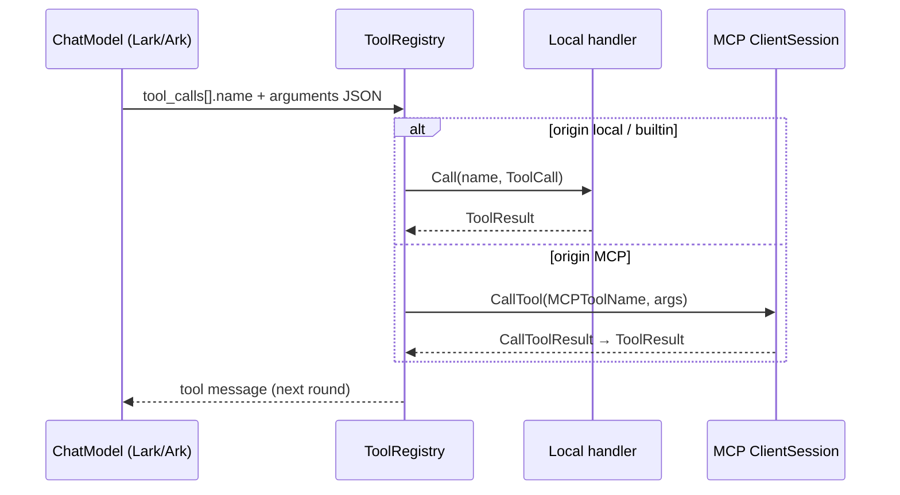

# MCP 工具与普通 function call 工具统一方案

> **目标**：在 loopForge 的 **单条 Agent loop** 中，让 **本地函数工具**、**MCP 远端工具** 与（可选）**内置工具** 对 **模型** 与 **执行器** 呈现 **同一套契约**，并说明与 **CloudWeGo Eino** 分层思想的 **对照关系**（**思路参考**，loopForge **不引入** Eino 等第三方编排 SDK 依赖）。  
> **关联文档**：`abstractions.md` §5–6、`multi-agent-engine.md` §3.2 / §3.7、`doc/log/progress-v0.6.0.md`。

---

## 1. 问题与原则

### 1.1 要解决的问题

- **模型侧**：OpenAI / Ark 等接口只认 **function `name` + `parameters`（JSON Schema）**；不关心工具来自本地还是 MCP。
- **执行侧**：本地工具走 **Go 回调**；MCP 工具走 **`ClientSession.CallTool`**（及会话上的 `ListTools` 发现）。
- **质量侧**：MCP `inputSchema` 可能含 Ark **不接受的 JSON Schema 关键字**；必须在 **唯一出口** 做归一化与清洗（与 v0.5.2 Lark 适配器策略一致）。

### 1.2 设计原则

| 原则 | 说明 |
|------|------|
| **单表面** | 所有可调用能力在 **一次** `tools` 列表中暴露给模型；名称全局唯一（MCP 用 **前缀 / ServerID** 防冲突）。 |
| **声明与执行分离** | **发给模型的**只有描述 + schema；**执行**只依赖 `tool_call.name` + `arguments` JSON 字符串。 |
| **单一路由** | 运行时 **`name → 处理器`** 一次解析；处理器内部再区分 local / MCP / builtin。 |
| **Schema 单出口** | 凡进入 `ToolCallingChatModel` / Ark 的 parameters，**必须经过** `pkg/model/adapters/lark` 已有 **sanitize**（或等价 helper），MCP 与本地 **无第二套规则**。 |

### 1.3 使用方 API 约束（自动发现与绑定）

| 约束 | 说明 |
|------|------|
| **配置即集成** | 使用方 **只提交** MCP 客户端所需信息（**`MCPServerProfile`**：transport、命令或 URL、环境/头、`ToolPrefix`、可选 allowlist）；**不**要求手写 **`[]*ToolInfo`**、**不**直接调用 **`ListTools` / `CallTool`** 完成注册。 |
| **SDK 封装** | loopForge 提供 **单次入口**（如 **`pkg/mcp.BootstrapToolInfos(ctx, ...MCPServerProfile)`**，名可定稿）：内部 **`mcp.Client` → `Connect` → `ListTools`**，生成 **`MCPMappedTool`**，归一化 schema，装配 **`ToolInfo`（含内部 `Handle` 或统一 `ToolExecutor`）**，并返回 **`stop`/`Close`** 与 session 对齐。 |
| **与 Agent 组合** | 使用方仅 **`append(本地 ToolInfo, mcpTools...)`** 后 **`agent.WithToolInfos`**；或未来由 Runner 在启动阶段代调 **`BootstrapToolInfos`**。 |
| **非目标** | 不把「为每个 MCP 工具手写 `Handle`」作为 **公开集成路径**；该逻辑仅存在于 **SDK 实现**或测试夹具。 |

### 1.4 调试面对外 API（`Ping` / `ListTools` / `CallTool`）

集成路径（**`BootstrapToolInfos`**）刻意 **隐藏** `ListTools` / `CallTool` 细节，但 **排障与自动化测试** 需要不经 Agent 的显式入口。为避免使用方把 **协议级调试 RPC** 与 **生产集成 API** 混在同一 import 里，**所有面向使用方的 `Ping` / `LIST`（`ListTools`）/ `CALL TOOL`（`CallTool`）能力** 放在 **独立子包**：

| 包路径（拟定） | 职责 | 与 `pkg/mcp` 的关系 |
|----------------|------|----------------------|
| **`loopforge/pkg/mcp`** | **`BootstrapToolInfos`**、会话生命周期、与 **`ToolInfo` 绑定** 等 **集成契约** | 主入口；**不包含** 显式 `Ping`/`ListTools`/`CallTool` 调试面（避免误用）。 |
| **`loopforge/debug`** | **`Dial` → `Conn`**，其上 **`Ping` / `ListTools` / `CallTool`**，仅用于 **联调、CLI、自动化测试** | 依赖 `pkg/mcp/cfg` 与 go-sdk；`package debug`，import 建议别名 **`lfdebug`**，避免与 **`runtime/debug`** 混淆；与 **`pkg/mcp`** 集成路径分模块。 |

**会话句柄**（示意名 **`Conn`**）：由 **`lfdebug.Dial(ctx, MCPServerProfile)`**（`import lfdebug "loopforge/debug"`）返回 **`Conn` + `stop`**。

| 方法（示意） | MCP 协议 | 用途 |
|--------------|----------|------|
| **`Conn.Ping(ctx)`** | `ping` | 验证 transport / session 是否可用（握手后探活）。 |
| **`Conn.ListTools(ctx)`** | `tools/list` | 拉取 **MCP 工具原名**与定义，与 **`BootstrapToolInfos` 绑定结果**对照，或用于 CLI **LIST** 展示。 |
| **`Conn.CallTool(ctx, mcpToolName, arguments)`** | `tools/call` | 按 **协议侧工具名**（非 LLM 暴露前缀名）直接调用，用于 **CALL TOOL** 级调试与集成测试。 |

**约定**：调试 API 的 **`CallTool`** 使用 **MCP 原名**；发给模型的 **`ToolInfo.Name`** 仍为 **`ToolPrefix` + 原名**（或别名），二者映射关系应在文档与（可选）**`unmap` 辅助**中说明。  
**可选扩展**：`ListResources` / `ReadResource`、`ListPrompts` / `GetPrompt` 等 **仅追加在 `loopforge/debug`**，按需排期，不阻塞最小调试面。

---

## 2. 与 Eino 概念的对照（思路参考）

以下路径来自 **`github.com/cloudwego/eino`**（本地 module 缓存示例：`.../eino@v0.7.14/...`），仅作 **设计对照**，loopForge **不依赖**该模块。

| Eino 概念 | 含义 | loopForge 对应 |
|-----------|------|----------------|
| `components/tool.BaseTool` → `Info(ctx) (*schema.ToolInfo, error)` | 给 **ChatModel** 做意图识别用的 **工具元数据** | **模型可见**：`pkg/model/types.ToolInfo`（`Name`、`Description`、`Parameters`）或引擎层 `pkg/runtime/tool.ToolDescriptor`；**无 Handle 的纯描述** 可来自 MCP `ListTools` 映射。 |
| `InvokableTool.InvokableRun(ctx, argumentsInJSON string, ...)` | **执行**只接收 **JSON 参数字符串** | **执行面**：`ToolCall.Arguments`（string）→ 本地 `Handle` 或 MCP `CallToolParams.Arguments`；与 Eino 一致，**不在此层再区分**「是不是 MCP」。 |
| `schema.ToolInfo` + `ParamsOneOf` / `ToJSONSchema()` | 参数既可 **结构化** 也可 **JSON Schema**，再转为发给模型的 schema | MCP 映射时：解析 MCP `inputSchema` → 归一化为 **`map[string]interface{}`**（与现有 `ToolInfo.Parameters` 一致），必要时剔除/改写关键词后再交给 Lark 适配器。 |

**结论**：Eino 用 **「Info = 声明」「InvokableRun = JSON 执行」** 切开两层；loopForge 用 **`ToolInfo`（+ 可选 `Handle`）** 与 **`ToolCall`/`ToolRegistry.Call`** 实现 **同构拆分**。

---

## 3. 统一数据模型（loopForge 现有类型）

### 3.1 模型可见：`*types.ToolInfo`

- **本地 function tool**：`pkg/model/types.ToolInfo` 含 `Name`、`Description`、`Parameters`（JSON Schema 对象）、**`Handle`**（`ToolCallHandler`）。
- **MCP 工具**：对每条 `MCPMappedTool`，构造 **同名 `ToolInfo`**：`Parameters` 来自 MCP 定义经 **parse + 归一化** 后的对象；**`Handle` 的实现**为「根据 `ServerID` + `MCPToolName` 调用 `ClientSession.CallTool`」，或对 **统一 Registry** 委托（见 §4）。

模型侧 **仅看到** `Name` / `Description` / `Parameters`，**无法**从 schema 上区分来源；来源保存在 **注册表元数据**（`ToolOrigin`、`SourceRef`）用于日志与策略。

### 3.2 引擎 / Runner 可见：`pkg/runtime/tool` + `internal/engine.ToolHandler`

现有 **`ToolHandler`** 已抽象为：

- `Descriptor() tool.ToolDescriptor` — 暴露名、描述、schema 字符串、`Origin`、`SourceRef`。
- `Call(ctx, tool.ToolCall) (*tool.ToolResult, error)` — **统一入口**，参数即模型产出的 **`Arguments` JSON 字符串**。

**本地工具**：`Call` 内解析 JSON → 调用户函数。  
**MCP 工具**：`Call` 内将 **`Name` 反查**为 `MCPToolName`（及 session）→ `CallTool`。

这与 Eino **`InvokableRun(..., argumentsInJSON)`** 对齐。

### 3.3 多 MCP 命名：`MCPMappedTool` / 前缀

- `pkg/mcp/cfg.MCPMappedTool`：`ExposedName`（模型所见）≠ `MCPToolName`（协议原样）。
- 路由表至少保存：`(ExposedName → ServerID, MCPToolName, session ref)`。

---

## 4. 统一调用链（端到端）

**合并 tools 列表**（每轮或启动时）：

1. 收集 **本地** `ToolInfo` / `ToolHandler` 的 descriptors。  
2. 对每个 MCP 连接执行 **`ListTools`**（或缓存 + 失效策略），生成 **`MCPMappedTool`**，再转为 **`ToolInfo`**（或等价 descriptor）。  
3. **`WithTools(merged)`** 绑定到 **`ToolCallingChatModel`**（与现有 Lark 适配器路径一致）。

**执行**：

1. 解析 `tool_calls` → 得到 **`Name` + `Arguments` 字符串**。  
2. **`ToolRegistry.Call(ctx, name, call)`**：按 `name` 查 **Origin** 与实现。  
3. MCP 分支：**禁止**用暴露名直接 `CallTool`；必须用 **`MCPToolName`** + 对应 **session**。

---

## 5. Schema 与 Lark / Ark 兼容（与 MCP 统一）

| 步骤 | 说明 |
|------|------|
| **Parse** | MCP 返回的 `inputSchema` 可能是字符串或对象；统一 **unmarshal** 为 `map[string]interface{}`。 |
| **Normalize** | **思路**上对齐 Eino **`ParamsOneOf`**：能结构化则补全 `type`、`properties`；否则保留子集 JSON Schema。 |
| **Sanitize** | **必须**走 `pkg/model/adapters/lark` 中 **`arkToolParametersForAPI`** 路径（strip 不支持的关键字、`arkEnsurePropertyTypes` 等），与 **本地工具** 相同。 |
| **Bind** | 将结果写入 `ToolInfo.Parameters`，再进入 **`toArkTools`**。 |

这样 **「MCP 工具 vs 普通 function call」** 在 **Ark 侧无差异**；差异仅在 **Handle / MCP 会话** 内部。

---

## 6. 模块落点建议

| 职责 | 建议位置 |
|------|----------|
| MCP 连接与 session | `internal/mcp`（或 `pkg/mcp`，与 `cfg` 对齐） |
| **`Ping` / `ListTools` / `CallTool`（使用方可见调试）** | **仅** `loopforge/debug`（与集成包分离） |
| `ListTools` → `MCPMappedTool` → `ToolInfo` 构建 | `pkg/mcp`（Bootstrap 内）+ 小函数 **`MCPToolToToolInfo`**（归一化 + 可选 allowlist） |
| 合并 descriptors / `WithTools` | `runner` / `engine` 初始化路径 |
| 统一 `Call` 分发 | 已有 **`internal/engine.ToolRegistry`** 扩展；与 **agent-sdk-go** 的 tool 执行点对接 |
| Ark schema 清洗 | **仅** `pkg/model/adapters/lark`（单一真相） |

---

## 7. 验收要点（与 v0.6.0 对齐）

- 同一 Run 内 **本地工具名** 与 **`seraglf__*`** 类 MCP 名 **可同时**出现在 `tools` 列表中。  
- 模型发起任意一种 **function call** 后，**消息回注路径**一致（`ToolResult` → assistant/tool 消息）。  
- 故意构造含 **`additionalProperties`** 等 MCP schema 时，经 **sanitize** 后 **不再**触发 Ark 400（与 v0.5.2 行为一致）。

---

## 8. 相关文档

| 文档 | 内容 |
|------|------|
| `abstractions.md` | `ToolDescriptor`、`ToolCall`、`MCPMappedTool`、调用表 |
| `multi-agent-engine.md` | §3.2 工具调用、§3.7 MCP 接入 |
| `doc/log/progress-v0.6.0.md` | MCP Client 选型、Eino **思路参考**、验收范围 |
