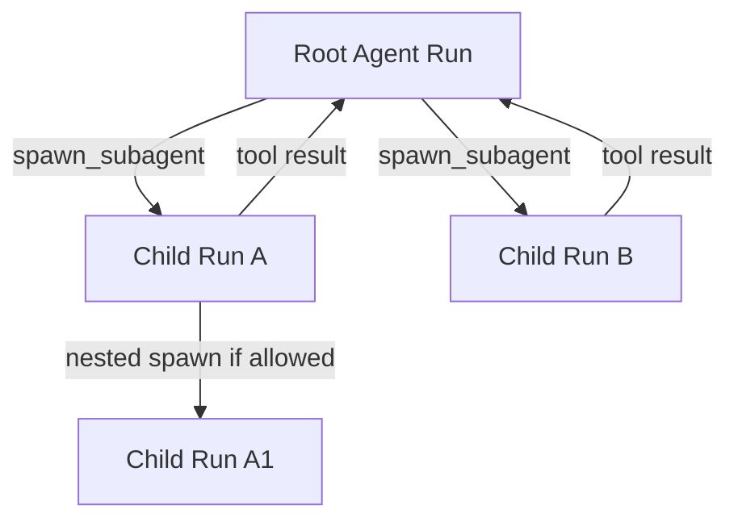
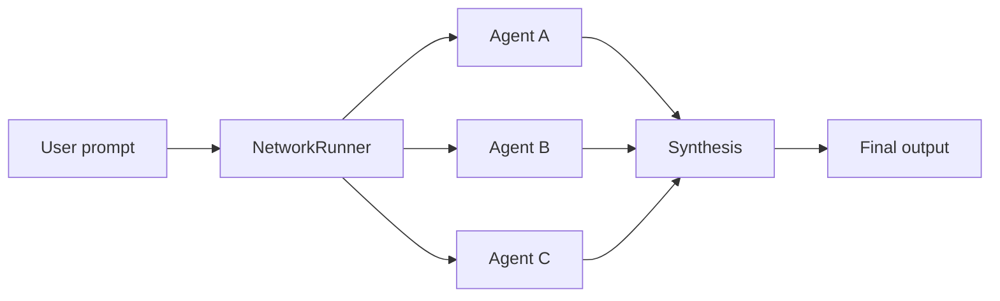

# loopForge Multi-Agent Engine 设计

> 目标：在 Go 中实现 **原生 Agent loop** 驱动的 **Multi-Agent 引擎**（可运行、可观测）。**模型调用**复用 `github.com/agentizen/agent-sdk-go`（**agent-sdk-go**）。  
> **边界**：本仓库**不**实现 Memory / RAG / 向量检索等业务能力；由 **MCP**（含 **SeRagLF** 等）以 **工具 / 资源** 形式接入。  
> **扩展能力**：**Skills**（可装载的领域指令包）、**多 MCP Server**、**动态子 Agent 生成（spawn）**——在运行中按模型产出的 **prompt/规格** 拉起短时子 Agent（语义上对齐 Claude Code 类「子任务 / subagent」体验，实现上仍是 **原生 Agent loop**）。  
> **阶段推进**：**Make it work → Make it right → Make it fast**（见 §1.4）。

## 1. 背景与目标

### 1.1 与「Graph 编排 / 伪 ADK」的区别（相对 Eino + SeRagLF）

| 形态 | 特征 | 典型用途 |
|------|------|----------|
| **Graph 编排（如 Eino）** | 节点为有向图上的算子，边表达数据流与条件分支；更像「管线 + 状态机上的伪 ADK」 | SeRagLF：Self-RAG 闭环、检索与反思节点固定拓扑 |
| **本引擎（loopForge）** | **原生 Agent loop**：模型在循环中交替「推理 →（可选）选工具 → 执行 → 写回消息」；Multi-Agent = **静态 Network 策略** + **动态 spawn 子 Agent**（见 §4） | 领域能力走 **Tool / MCP**；行为约束与流程知识走 **Skills** |

本 demo **不以 Graph 作为编排内核**；编排语义落在 **runner 迭代 + network 调度**，与「先构图再跑图」的心智模型不同。

### 1.2 要解决什么（引擎职责）

- **多智能体协作**：
  - **静态**：预置 roster + `pkg/network`（并行 / 流水线 / 竞速 / 自定义编排）；
  - **动态**：运行时 **spawn** 子 Agent（由父模型生成任务说明 / system 片段 / 工具白名单等），子 Agent 跑完即回收，结果回注父上下文。
- **可控的执行循环**：停止条件、最大步数、失败重试与退避；对 **spawn 树** 叠加 **深度 / 并发 / 预算** 上限，避免子 Agent 爆炸。
- **Skills**：可发现、可版本化的指令与流程包，注入到指定 Agent 的上下文中（见 §3.6）。
- **工具调用一等公民**：含 **JSON Schema**、超时、结果回注；**本地函数**、**MCP tools**、以及 **spawn**（若暴露为工具）统一进入 tool surface。
- **MCP**：多 Server、工具发现、可选 Resources/Prompts 映射策略（见 §3.7）。
- **可选规划**：Planner 可作为独立 Agent 或提示词约束，不强制进入主路径。
- **可观测性**：Trace（跨 Agent 层级 / 跨工具 / 跨 MCP）、Token、基于模型目录估算 Cost。

### 1.3 非目标（明确排除）

- **不在引擎内**实现长期记忆、RAG、向量库、文档ingest；由 **SeRagLF MCP** 提供对应 Tools，引擎只负责 **发起 MCP 调用并处理返回**。
- 替换各云厂商原生 SDK 的全集能力；Provider 细节由 agent-sdk-go 覆盖。

### 1.4 阶段性目标（Make it work → Make it right → Make it fast）

工程推进按经典三阶段划分；**顺序不可颠倒**：未跑通前不优化，未正确前不追求极限性能。

| 阶段 | 口号 | 关注点 | loopForge 落地示例（可调整） |
|------|------|--------|------------------------------|
| **I** | **Make it work** | 端到端 **可运行**、可演示；允许技术债 | 单 Agent `runner.Run`；接 **一个** MCP（如 SeRagLF）并成功 **一次** tool；静态 Network 任选一种策略 **跑通**；最小 **LoopPolicy**（如仅 `MaxStep`）；日志级观测即可 |
| **II** | **Make it right** | **语义正确**、边界清晰、可维护、可测 | **Spawn** 深度/并发/预算硬限制与单测；**Skills** 受信路径与审计；MCP **前缀/白名单**；**RunState** 与错误码稳定；OTel trace + token/cost **口径一致**；Dev UI **可用**（§8）；与 §6 验收对齐 |
| **III** | **Make it fast** | 在 **II** 之上做 **可度量** 优化 | pprof/火焰图；热路径少分配；MCP/HTTP **连接复用**；多 Agent **并行**策略下的并发与队列；模型目录/配置 **缓存**；Dev UI 与事件总线 **不阻塞**主 loop（异步、采样） |

**原则**：**work** 阶段不强行上全量能力；**right** 阶段补测试与契约再谈 SLA；**fast** 阶段每项优化需有 **before/after** 指标（延迟、alloc、token 无关成本除外）。

### 1.5 最小内核与外部参考（MVP 融合）

将「Agent 引擎」压到 **两个本质** + **三种 action**，便于 **demo 先跑通**（与外部讨论的极简版一致，已写入独立文）：

| 本质 | 含义 |
|------|------|
| **Skill** | **MCP + Tool Registry**（发现 / 调用统一映射到具名 tool） |
| **Spawn** | **LLM 决策 → 子 prompt/goal → 子 agent loop（递归）→ 回注** |

| 一步决策（概念） | 说明 |
|------------------|------|
| `tool` | 调工具（含 MCP） |
| `spawn_agent` | 起子 Run，建议带 **`allowedTools` 沙箱** |
| `finish` | 结束并返回答案 |

**实现注意**：不必手写庞大 `switch`——生产上多用 **LLM tool_calls**；**spawn** 可做成 **builtin tool**，仍属同一 loop。避坑与对外表述见 **`abstractions.md` §2**。

---

## 2. 总体架构

### 2.1 分层

```
┌──────────────────────────────────────────────────────────────────────────┐
│                     loopForge (Multi-Agent engine)                        │
│  LoopPolicy │ ToolRegistry │ SkillLoader │ Spawner │ RunContext           │
│  MultiAgent(network static) │ Observability │ MCP connector manager       │
│  DevServer (debug UI API, optional)                              │
└───────────────────────────────┬──────────────────────────────────────────┘
                                │ uses
┌───────────────────────────────▼──────────────────────────────────────────┐
│              agent-sdk-go (Agent loop + tools + network)                  │
│  pkg/agent │ pkg/runner │ pkg/tool │ pkg/network │ pkg/model/...         │
│  pkg/model/providers/*                                                   │
└───────────────┬─────────────────────────────┬────────────────────────────┘
                │ HTTPS                      │ MCP (stdio / Streamable HTTP / ...)
┌───────────────▼───────────────┐   ┌─────────▼────────────────────────────┐
│   LLM Providers             │   │  MCP Servers (plural)                 │
│   (OpenAI, Anthropic, ...)  │   │  SeRagLF (RAG/Memory) │ others (fs, ...) │
└─────────────────────────────┘   └────────────────────────────────────────┘
```

**原则**：

- **agent-sdk-go**：单 Agent **迭代式** `runner`、tool 协议、`pkg/network` 的**静态**多 Agent 策略。
- **loopForge**：**循环策略、Run 状态、观测、工具注册表**；**SkillLoader**；**多 MCP 连接与 tool 聚合**；**Spawner**（动态创建子 `Agent` 并执行子 `Run`，仍走同一套 runner）。
- **领域记忆 / RAG**：由 **SeRagLF** 等 MCP 提供；引擎不实现向量逻辑，只实现 **MCP 客户端与工具映射**。
- **可调试 UI**：可选 **DevServer**（本机 HTTP）+ **Web 客户端**，模式对齐 **Eino Dev + eino-ext/devops**（见 §8）。

### 2.2 与 SeRagLF 的分工

| 维度 | SeRagLF | loopForge |
|------|---------|-----------|
| 编排内核 | Eino `compose.Graph`（**图节点 = 管线算子**，领域闭环在图内） | **Agent loop** + `pkg/network`（**迭代 + 调度**） |
| LLM 调用 | Eino ChatModel | agent-sdk-go `pkg/runner` + providers |
| Memory / RAG | Gateway 内 Self-RAG、Memory 模块、Qdrant 等 | **不实现**；通过 **MCP 工具** 调用 SeRagLF |
| 产品形态 | MCP Server（工具/资源提供方） | Multi-Agent **引擎**（调用方之一，可再包一层 HTTP/CLI） |

---

## 3. 核心能力设计

### 3.1 Loop control（循环控制）

**需求映射**：停止条件、最大步数、重试。

建议拆成三类策略，全部可组合：

| 策略 | 含义 | 典型实现位置 |
|------|------|----------------|
| **MaxStep** | 单次 Run 内允许的大模型+工具轮数上限 | loopForge `LoopPolicy` 在每次 `runner` 迭代前后递增计数 |
| **StopPredicate** | 基于状态判断是否结束（如：得到 `FinalAnswer`、工具返回 `done=true`） | 与 Agent 输出解析或工具协议约定 |
| **RetryPolicy** | 网络错误、429、可重试错误 | 指数退避 + jitter；与 Provider 无关，放在 loopForge 或 thin 包装层 |

**状态载体**：使用显式 `RunState`（run_id、step、last_error、termination_reason），每次迭代写入观测系统，便于审计。

### 3.2 Tool calling（工具调用）

agent-sdk-go 已提供 `pkg/tool`（函数工具与 Schema）。loopForge 侧补充：

- **统一注册表**：工具名 → 实现、Schema、超时、是否允许并行。
- **MCP 工具**：通过 MCP client 将各 Server 暴露的 tools **映射**为同一套 tool surface（名称、参数 schema、调用 → JSON-RPC），使模型 **无法区分**「本地函数」与「远程 MCP」。
- **Spawn（可选）**：将「创建并运行子 Agent」实现为 **受控内置工具**（如 `spawn_subagent`），参数包含子任务说明、system 追加片段、工具白名单、子 Run 的 `LoopPolicy` 覆盖项；由 **Spawner** 创建子 `Agent` 实例并阻塞或异步执行子 `Run`，最终以 tool result 回到父线程（见 §3.8）。
- **沙箱边界**：可选对入参大小、调用频率做限制（按产品要求）。
- **结果回注**：tool result 进入消息历史，由 runner 进入下一轮 loop。

### 3.3 Memory / RAG（本引擎中的位置）

**不作为独立子系统实现**。需要记忆与检索时：

1. 运行 SeRagLF MCP 服务（或指向已部署 endpoint）。
2. 在 loopForge 启动时 **Discover + Register** 其 tools（或白名单子集）。
3. Agent 在 **原生 loop** 中按需调用（例如检索、记忆写入等，具体以 SeRagLF 工具定义为准）。

会话级「上下文窗口」仍由 **对话消息列表** 自然承载；若需摘要压缩，可用 **同一 loop 内** 的额外一步或独立 Agent，**不必**引入 Graph 编排内核。

### 3.4 Planning（可选）

1. **提示词规划**：system prompt 约束先输出计划再调工具。
2. **Planner Agent**：独立 Agent 产出计划，再由 `network` 的 Sequential / Parallel 消费。

本 demo **不采用 Eino Graph 做规划子图**；若将来有非 loop 的强 DAG 需求，应在单独服务中用 Graph 解决，避免把 loopForge 变成「双编排内核」。

### 3.5 Observability（trace / token / cost）

| 信号 | 来源 | 说明 |
|------|------|------|
| **Trace** | OpenTelemetry：`Run` 为 root span；子 span 含每轮 LLM、每次 tool、**每次 MCP**、**每次 spawn 子 Run**、**Skill 装载** | `spawn` 子 Run 使用 **linked span** 或子 trace，携带 `parent_run_id`、`depth` |
| **Token** | Provider 响应 usage 字段 | 汇总到 `RunMetrics`；**子 Agent 用量向上聚合**到根 Run |
| **Cost** | agent-sdk-go `pkg/model` 模型目录中的 `Pricing` | `GetModelSpec` 查询单价；`cost ≈ (input_tokens/1e6)*input_price + (output_tokens/1e6)*output_price`（具体以目录字段为准） |

### 3.6 Skills（技能 / 指令包）

**定位**：不是「再实现一套 Graph」，而是给 **Agent loop** 增加**可组合的行为与流程知识**（对齐 Cursor **Agent Skills** 一类体验：可发现、可版本、可审计）。

| 要素 | 说明 |
|------|------|
| **载体** | 例如目录下的 `SKILL.md`（front matter：name、version、description）+ 正文指令；或等价 JSON 清单（由引擎解析） |
| **发现** | 启动扫描 `SKILL_PATH`；或运行时通过工具 **`load_skill(name)`**（若开放）仅加载白名单技能 |
| **注入** | 将 skill 正文以 **system** 或 **developer** 消息片段挂载到**指定 Agent**（根 Agent / 某 spawn 子 Agent），并可与 **MCP Prompts** 区分优先级（引擎策略：后加载覆盖或显式优先级字段） |
| **与子 Agent** | 父模型在 `spawn` 参数中可指定 **附加 skill 列表**，用于只给子任务「临时家规」，避免污染根上下文 |
| **安全** | 技能来自**受信根目录**或签名清单；禁止未校验路径；记录审计日志（谁、何时、加载了哪一版 skill） |

### 3.7 MCP 接入（多 Server、工具与资源）

**SeRagLF** 是 **一个** MCP Server；引擎侧按 **通用 MCP 客户端** 建模：

| 能力 | 说明 |
|------|------|
| **多连接** | `MCP connector manager` 维护多个 `ServerConfig`（transport：stdio / Streamable HTTP 等），每连接独立 session |
| **Tools** | `tools/list` + 映射到统一 ToolRegistry；支持 **前缀**（如 `seraglf__retrieve`）避免跨服撞名 |
| **Resources（可选）** | `resources/list` / `read`：可映射为**只读工具**、或在 Run 启动时 **预取**进上下文（由产品策略决定） |
| **Prompts（可选）** | `prompts/list` / `get`：可与 **Skills** 合并为「提示来源」管线（引擎定义优先级） |
| **鉴权** | 每 Server 独立 headers / env；敏感信息不进模型上下文 |

领域上 **Memory / RAG** 仍主要由 **SeRagLF** 的 tools 提供；其它 MCP（如文件系统、浏览器）按同样机制挂载。

### 3.8 动态子 Agent 生成（spawn）

**目标**：对齐 **Claude Code** 类体验——主 Agent 在 loop 中判断「需要独立子任务」时，**生成子任务规格**并 **拉起短时 sub agent**，子 agent 自带 **可生成/可编辑的 prompt 片段**（instruction），跑完将**结构化或文本结果**返回父级。

**与静态 `pkg/network` 的关系**：**互补**。静态 Network = 人/配置预置多角色流水线；**spawn** = 运行时按需创建 **ephemeral** 角色实例。

**建议生命周期**：

1. **触发**：父模型调用内置工具 `spawn_subagent`（或引擎 API，但 tool 形式最利于统一 loop）。
2. **输入参数（示意）**：`task`（子目标描述）、`system_addendum`（追加到子 Agent system）、`skill_ids`（可选）、`tool_allowlist`（可选，默认继承父连接但可收紧）、`loop`（子 Run 的 max_steps / timeout）、`model_override`（可选）。
3. **执行**：Spawner `NewAgent(...)` + `runner.Run`（**新 Run id**），子上下文 **不默认包含** 父对话全量，仅包含参数与引擎注入的元数据（可按策略 **摘要父状态**）。
4. **结束**：子 Run 满足 `StopPredicate` 或触顶 `MaxStep` / 超时 → 将最终消息或约定结构作为 **tool result** 返回父 Agent。
5. **观测**：子 Run 的 trace、token、cost **rollup** 到根；`depth` 字段防止无限递归。

**硬限制（必须在引擎层强制执行）**：

| 限制 | 含义 |
|------|------|
| **MaxDepth** | spawn 树最大深度（例如根为 0，子为 1） |
| **MaxConcurrentSpawns** | 同一父 Run 同时未完成的子 Run 数 |
| **Budget** | 子树 token / 金额上限（可选） |
| **Allowlist** | 仅允许调用声明过的 MCP 前缀或工具名 |



---

## 4. Multi-Agent 拓扑

### 4.1 静态 Network（预置 roster）

agent-sdk-go 的 `pkg/network` 提供：

- `StrategyParallel`：独立子任务吞吐优先。
- `StrategySequential`：流水线依赖。
- `StrategyCompetitive`：竞速低延迟。

loopForge 在上层定义：

- **Agent roster**：角色描述、工具子集、模型选择、**默认 Skills**。
- **Handoff 规则**：何时从 Agent A 切换到 B（可由网络策略 + 停止条件共同约束）。
- **自定义编排**：参考上游 `examples/agent_network_custom_orchestrator`。



### 4.2 动态 spawn（与 4.1 正交）

同一用户任务可在 **根 Agent**（或静态 Network 中任一节点）的 **单次 loop** 内多次 spawn；子 Agent **不**必须先出现在 roster 中。适合「探索性拆解」「临时专家」场景。

---

## 5. 建议代码布局（落地时）

以下为建议包结构，便于与本文档一一对应：

```
loopForge/
  cmd/
    loopforged/          # HTTP/gRPC entry or CLI
  internal/
    engine/              # RunSession, LoopPolicy, Spawner, termination
    skill/               # SkillLoader, SKILL.md parse, injection policy
    mcp/                 # Multi-server connector manager, tool/resource mapping
    observability/       # OTel, metrics, cost rollup (incl. child runs)
    devserver/           # In-process HTTP debug API (see section 8)
    network/             # Wrappers around agent-sdk-go network if needed
  web/
    devui/               # Optional: Vite/React or static bundle for debugger UI
  skills/                # Optional: built-in or example SKILL.md tree
  doc/
    design/
    decision/
```

**依赖**：`go get github.com/agentizen/agent-sdk-go`（版本以 `go.mod` 锁定为准）。

---

## 6. 「Run 起来」验收标准（首版）

1. 配置模型 Provider 的 `API_KEY` 与模型名，可通过 CLI 或最小 HTTP 触发一次 **单 Agent** `runner.Run`。
2. 同配置下可触发一次 **Network**（三策略之一），得到合成输出。
3. **MCP**：至少连接 **一个** MCP Server（可与 SeRagLF 联调），在 loop 中成功执行至少一次 **MCP tool**，并看到结果回注；工具名冲突时验证 **前缀**策略。
4. **Skills**：能从配置路径加载至少一个 `SKILL.md`，并在 Run 中观察到 **注入后的行为差异**（或审计日志中有装载记录）。
5. **Spawn**：根 Agent 通过 `spawn_subagent`（或等价 API）创建 **一层**子 Run，子 Run 结束结果回注父消息；违反 **MaxDepth** 时拒绝并返回明确错误。
6. 日志或导出中可见 **step 计数**、**累计 tokens**（含子 Run 聚合）、**估算 cost**。
7. 可选：OTel 中可见 **父子 Run** 的 span 关系（本地 Jaeger 或 stdout）。
8. **Dev UI**：启用 `devserver` 后，浏览器打开调试页可看到 **至少一次** Run 的 step 时间线与 tool 记录（或等价：Jaeger 中展开同一次 trace）。

---

## 7. 风险与缓解

| 风险 | 缓解 |
|------|------|
| agent-sdk-go 版本与 Go 版本要求较新 | 在 `go.mod` 固定版本；CI 矩阵覆盖 |
| 多 Agent 成本失控 | MaxStep + 模型级预算 + Competitive 策略慎用 |
| MCP 与引擎状态不一致 | **RunState** 为单一编排事实来源；RAG/记忆事实以 MCP tool 返回为准，引擎不缓存第二套长期状态除非明确设计缓存层 |
| **Spawn 风暴 / 成本爆炸** | 强制 **MaxDepth**、**MaxConcurrentSpawns**、子树 **budget**；`spawn` 默认走白名单工具 |
| **Skill 注入滥用** | 仅信任目录 + 版本审计；敏感操作仍走 MCP 权限，不把密钥写进 skill 正文 |
| **调试接口暴露** | 默认仅 `127.0.0.1`；生产关闭或鉴权；敏感 tool 入参脱敏后再进 UI |

---

## 8. 可调试 UI（对标 Eino Dev 模式）

### 8.1 Eino 侧用的是什么

CloudWeGo **Eino** 的图/链调试不依赖自研重型控制台，而是 **IDE 插件 + 进程内 HTTP 服务**：

| 组件 | 说明 |
|------|------|
| **Eino Dev** | 开源 **IDE 扩展**（[VS Code](https://www.cloudwego.io/docs/eino/core_modules/devops/ide_plugin_guide/) / GoLand），在编辑器内做 **Graph / Chain 拓扑可视化**、从任意节点 **Test Run**、查看节点 **I/O 与耗时** |
| **`eino-ext/devops`** | Go 库：`github.com/cloudwego/eino-ext/devops`，在业务进程内调用 **`devops.Init(ctx)`** 启动 **本机 HTTP 调试服务**（默认端口 **52538**，可 `WithDevServerPort` 配置）；插件通过 **`IP:Port`** 连接（支持远程机器上跑着的进程） |
| **前置条件** | 官方文档要求：目标编排至少执行过一次 **`Compile()`**；且 **`devops.Init()` 须在 `Compile()` 之前**（见 [Visual Debugging Guide](https://www.cloudwego.io/docs/eino/core_modules/devops/visual_debug_plugin_guide/)） |

loopForge **不是** Eino Graph，**不能**直接复用 Eino Dev 对「节点」的调试协议；但应采用 **同一类架构**：**进程内 Dev Server + 可视化 UI**。

### 8.2 loopForge 推荐形态（同类模式）

| 层级 | 建议 | 与 Eino 的对应关系 |
|------|------|---------------------|
| **Dev Server** | 在 `loopforged`（或引擎嵌入模式）中启动 **仅监听本机** 的 HTTP 服务（如 `:17380`，避免与 Eino 默认 **52538** 冲突），提供 **Run 列表、当前 step、tool/spawn/MCP 事件、聚合 token/cost** 的 JSON API；可选 **SSE** 推送实时事件 | 对应 `devops.Init()` 起的调试服务 |
| **Web UI** | **自建轻量前端**（建议 `web/devui/`：Vite + React/Vue，或 embed `dist` 静态资源），通过浏览器访问 Dev Server；视图侧重 **时间线 / spawn 树 / tool 折叠面板**，而非 DAG 节点 | 对应 Eino Dev 插件里的可视化面板；loopForge 用 **浏览器** 降低对特定 IDE 的绑定 |
| **Trace 复用** | 观测层已计划 OTel：同一 Run 可 **并行** 导出到 **Jaeger** / **Grafana Tempo**，用成熟 **Trace UI** 做跨服务对照；与自建 Web UI **互补**（前者偏标准 tracing，后者偏 Agent 领域字段） | Eino 强调编排拓扑；loopForge 强调 **loop + spawn** 语义，Trace UI 通用性强 |

**最小 API 示意（概念）**：`GET /debug/runs`、`GET /debug/runs/{id}/events`、`GET /debug/runs/{id}/tree`（spawn 层级）；具体路径以实现为准。

### 8.3 可选增强（非必选）

- **IDE 内嵌**：若团队强依赖 VS Code，可后续做 **薄插件** 仅嵌入 `webview` 指向 `http://127.0.0.1:17380`，体验接近 Eino Dev，但 **首版以浏览器 UI 为主** 即可交付。
- **若局部引入 Eino 子图**（仅当产品真的需要）：可在该子模块中单独 `devops.Init()`，用 **Eino Dev** 调 Graph；与 loopForge 主 **Agent loop** 调试仍分属两套 UI，文档中需向用户说明边界。

### 8.4 参考链接

- [Eino Dev Visual Debugging Guide](https://www.cloudwego.io/docs/eino/core_modules/devops/visual_debug_plugin_guide/)
- [Eino Dev Plugin Installation (IDE)](https://www.cloudwego.io/docs/eino/core_modules/devops/ide_plugin_guide/)
- 示例工程：`https://github.com/cloudwego/eino-examples`（含 `devops/debug`）

---

## 9. 文档索引

- 关键抽象（**MVP 最小内核 §2**、**RuntimeAction**、Agent 交换、**Tool**、**MCP**）：`abstractions.md`
- **对外事件与标识类型对齐**（`EventMessage` / `EventMessageType`、segment 三元组语义）：`data-fusion.md`
- 架构规划（系统拓扑、模块边界、部署与安全）：`architecture.md`
- 选型与备选方案：`../decision/sdk-selection.md`
